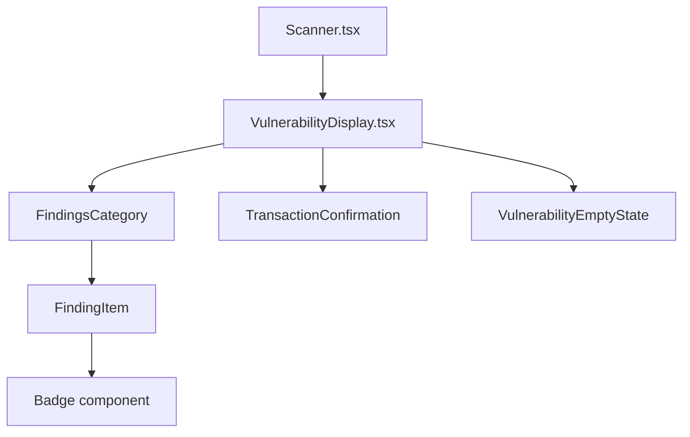

# Design Document: Vulnerability Display

## Overview

This feature creates a new `VulnerabilityDisplay` component that replaces the raw JSON findings display in the Scanner component. It provides a categorized, visually appealing view of security findings with severity indicators, empty states, and transaction confirmation.

## Code Reuse Analysis

### Existing Components to Leverage
- **Card**: Existing UI component for container styling
- **Badge**: Existing UI component for severity labels
- **getRiskColor, getRiskLevelColor**: Existing utility functions in `lib/api.ts`
- **lucide-react icons**: CheckCircle, AlertCircle, Shield, AlertTriangle, etc.

### Integration Points
- **Scanner.tsx**: Will import and use VulnerabilityDisplay component
- **types/index.ts**: Will extend AuditFindings type to include credentials field
- **AuditResult**: Existing type already has findings structure

## Architecture

The design follows a component composition pattern where small, focused components are composed together.



## Components and Interfaces

### VulnerabilityDisplay Component
- **Purpose:** Main container that orchestrates the vulnerability display
- **File:** `components/ui/VulnerabilityDisplay.tsx`
- **Props:**
  ```typescript
  interface VulnerabilityDisplayProps {
    findings: AuditFindings;
    riskLevel: RiskLevel;
    transactionHash?: string;
    paidAmount?: string;
  }
  ```
- **Dependencies:** FindingsCategory, TransactionConfirmation, EmptyState
- **Reuses:** Card, Badge from existing UI components

### FindingsCategory Component (internal)
- **Purpose:** Displays a single category of findings (malware, credentials, network, permissions)
- **Props:**
  ```typescript
  interface FindingsCategoryProps {
    title: string;
    icon: React.ReactNode;
    findings: string[];
    color: "green" | "yellow" | "orange" | "red";
  }
  ```
- **Dependencies:** FindingItem
- **Reuses:** None (internal component)

### FindingItem Component (internal)
- **Purpose:** Displays a single finding with severity indicator
- **Props:**
  ```typescript
  interface FindingItemProps {
    finding: string;
    severity?: "LOW" | "MEDIUM" | "HIGH" | "CRITICAL";
  }
  ```
- **Dependencies:** None
- **Reuses:** Badge component

### TransactionConfirmation Component (internal)
- **Purpose:** Displays payment confirmation with BaseScan link
- **Props:**
  ```typescript
  interface TransactionConfirmationProps {
    transactionHash: string;
    amount: string;
    network: string;
  }
  ```
- **Dependencies:** None
- **Reuses:** External link icon from lucide-react

## Data Models

### Extended AuditFindings
```typescript
interface AuditFindings {
  malware: string[];
  credentials: string[];  // Added field
  network: string[];
  permissions: string[];
}
```

### Category Configuration
```typescript
interface CategoryConfig {
  key: keyof AuditFindings;
  title: string;
  icon: React.ComponentType;
  emptyMessage: string;
  color: string;
}

const CATEGORIES: CategoryConfig[] = [
  { key: "malware", title: "Malware Detection", icon: Bug, emptyMessage: "No malware detected", color: "red" },
  { key: "credentials", title: "Credential Exposure", icon: Key, emptyMessage: "No credentials exposed", color: "orange" },
  { key: "network", title: "Network Security", icon: Globe, emptyMessage: "No network issues", color: "yellow" },
  { key: "permissions", title: "Permission Analysis", icon: Shield, emptyMessage: "No permission issues", color: "blue" },
];
```

## UI Layout

### With Vulnerabilities Found
```
┌─────────────────────────────────────────────────────────┐
│ ✓ Audit Complete                    ID: abc123         │
│   Payment successful - 0.05 USDC                        │
├─────────────────────────────────────────────────────────┤
│ ┌─────────────┬─────────────┬─────────────┐            │
│ │ Risk: 45/100│ Level: MED  │ Rec: CAUTION│            │
│ └─────────────┴─────────────┴─────────────┘            │
├─────────────────────────────────────────────────────────┤
│ 🐛 Malware Detection                                    │
│   ├─ [HIGH] Suspicious eval() usage                     │
│   └─ [MED] Dynamic code execution                       │
│                                                         │
│ 🔑 Credential Exposure                                  │
│   └─ ✓ No credentials exposed                           │
│                                                         │
│ 🌐 Network Security                                     │
│   └─ [LOW] External API call to untrusted domain       │
│                                                         │
│ 🛡️ Permission Analysis                                  │
│   └─ ✓ No permission issues                             │
├─────────────────────────────────────────────────────────┤
│ 💳 Transaction Confirmed                                │
│   0.05 USDC on Base · View on BaseScan ↗               │
└─────────────────────────────────────────────────────────┘
```

### No Vulnerabilities (Clean Scan)
```
┌─────────────────────────────────────────────────────────┐
│ ✓ Audit Complete                    ID: abc123         │
├─────────────────────────────────────────────────────────┤
│ ┌─────────────┬─────────────┬─────────────┐            │
│ │ Risk: 0/100 │ Level: LOW  │ Rec: SAFE   │            │
│ └─────────────┴─────────────┴─────────────┘            │
├─────────────────────────────────────────────────────────┤
│                    🛡️                                   │
│           No Vulnerabilities Detected                   │
│                                                         │
│   ✓ No malware signatures found                         │
│   ✓ No credential exposure detected                     │
│   ✓ No suspicious network activity                      │
│   ✓ No excessive permissions requested                  │
├─────────────────────────────────────────────────────────┤
│ 💳 Transaction Confirmed                                │
│   0.05 USDC on Base · View on BaseScan ↗               │
└─────────────────────────────────────────────────────────┘
```

## Error Handling

### Error Scenarios
1. **Missing findings data**
   - **Handling:** Display empty state with "Unable to load findings"
   - **User Impact:** User sees a graceful fallback message

2. **Invalid transaction hash**
   - **Handling:** Hide transaction section, show payment amount only
   - **User Impact:** User still sees payment confirmation without link

3. **Malformed finding string**
   - **Handling:** Display raw string without severity parsing
   - **User Impact:** User sees the finding but without color coding

## Testing Strategy

### Unit Testing
- Test VulnerabilityDisplay with various findings combinations
- Test empty state rendering when all categories empty
- Test severity badge color mapping
- Test transaction link generation

### Integration Testing
- Test Scanner component integration with VulnerabilityDisplay
- Test that findings from API response render correctly

### End-to-End Testing
- Complete audit flow showing vulnerability display
- Verify transaction link opens correct BaseScan page
